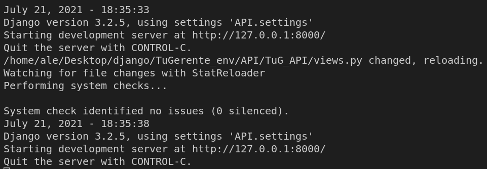
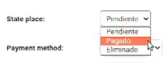

# Prueba Django

Utilizando Django REST Framework, desarrollá los endpoints para el sistema de reservas de habitación de un hotel.
CONDICIONES:

- Las reservas pueden tener 3 estados: Pendiente, Pagado y Eliminado.
- Los datos a almacenar para la reserva son: los detalles del cuarto reservado, los días de estadía, los datos de facturación e identificación del cliente, el monto pagado y el método de pago.
- Proponé los endpoints a crearse para tratar de cubrir el flujo normal de operación de reserva y explicar por qué.
Luego que tengas ya todo el código
-Crear un repositorio para la entrega del código y en un readme del repositorio la justificación de los endpoints creados

# Solución

Para el reto se empleo el desarrollo de un dashboard de administración utilizando Django, se crearon 2 tipos de usuarios, el primero es el administrador del hotel el cual se encarga de registrar y editar todos los datos de cada cliente y el segundo es un enlace público el cual ayuda a concectar la API a otros servicios de consulta. 

## Datos recopilados

El primer paso que se empleo fué el de listar los datos a almacenar, en este caso se recopilaron los siguientes datos:

- Nombre
- Teléfono
- Email
- Inicio de reserva (Día y hora)
- Fin de reserva (Día y hora)
- Estado de la reserva (Pendiente, Pagado y Eliminado)
- Tipo de pago (Tarjeta, Transferencia, Efectivo)
- NIT
- Habitación
- Monto de pago
- El ID de cada cliente se genera de manera automática dentro del sistema

## Desarrollo

Se inicio creando un ambiente virtual de programación.

```bash
  python3 -m venv TuGerente_env
  source TuGerente_env/bin/activate
```

Dentro del ambiente virtual se instala la libreria de Django

```bash
  pip3 install Django
```

Se procede a crear el proyecto e iniciarlo, todos los archivos se encuentran en la carpeta ```TuGerente_env```. Después de hacer las migraciones y configuraciones y código del proyecto, se debe crear un superuser.


```bash
  python3 manage.py createsuperuser
```

Nos pedirá ingresar un nombre, correo y contraseña.

| Nombre | Correo     | Contraseña                |
| :-------- | :------- | :------------------------- |
| `TuGerente` | `mail@tugerente.com` | **123456** |

Para ejecutar el servidor ejecutamos el siguiente comando.

```bash
  python3 manage.py runserver
```
Una vez ejecutado se debe ingresar al enlace que aparece en terminal



Debemos ingresar al enlace: http://127.0.0.1:8000/, la primera vez nos aparece el siguiente error, ya que debemos especificar una dirección.


Para ello entramos al dashboard de administración, mediante este enlace: http://127.0.0.1:8000/admin/login/?next=/admin/, ingresamos los datos del superusuario. 


Para añadir a un nuevo usuario precionamos `Persons` y `ADD PERSON`.


Nos despliega un formulario en los cuales debemos añadir a los usuarios, se tomaron en cuenta los datos a almacenar presentados en `Datos recopilados`, además cada campo es validado deacuerdo a lo que corresponda (si el dato es correo se almacena en string, si es número solo tipo de datos enteros, si solo habian 3 opciones como Estado de la reserva, solo puede seleccionar una opción).

### Vista completa


### Vista específica




### Llenado de formulario


Llenado el registro de usuarios se procede a hacer la consulta de manera pública sin necesidad de tener una cuenta. Ingresando al enlace http://127.0.0.1:8000/api/person/ para listar a todas las personas registradas.


Para filtrar a un usuario por ID o número de facturación y saber el estado del mismo. http://127.0.0.1:8000/api/person/3/, donde el 3 especifíca el número de ID.


Finalmente para buscar una persona que tenga ciertos caracteres en el nombre. 


Datos de contacto: ale.nunez.arroyo@gmail.com

